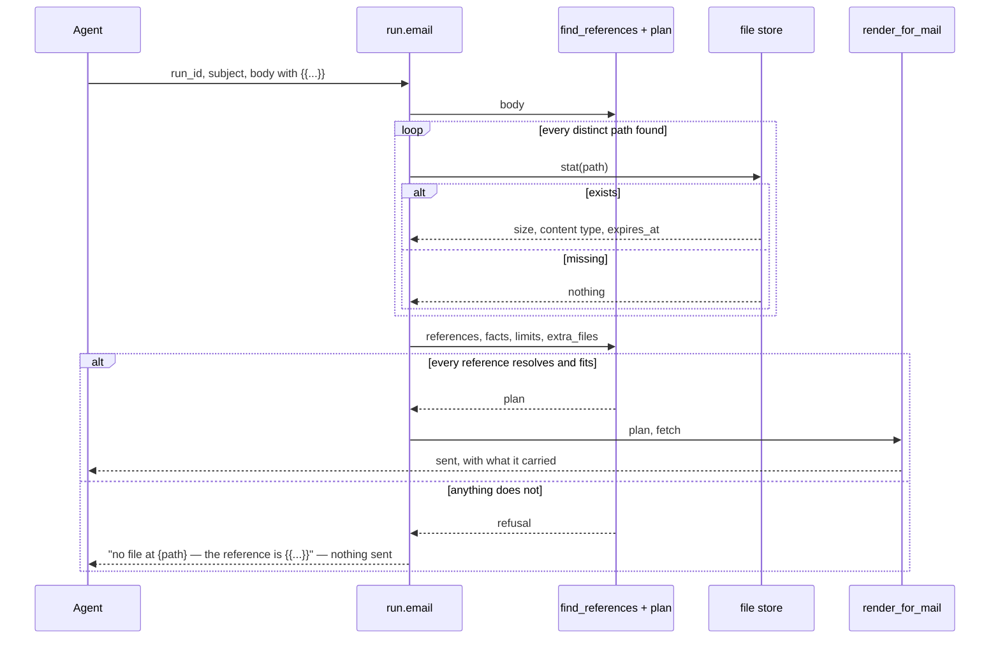

# Option 1 — the server expands the body, in the one place that already builds the mail

The person writes `{{...}}` in `body` and sends. The call that turns a body into a mail reads
the body first, resolves every reference, and builds the message from what it found.

## Classes

| Class | What changes |
|---|---|
| `run.email(run_id, subject, body)` | unchanged signature. It gains a pass over `body` before the mail is built |
| `find_references` + `plan` | the grammar and every rule. Both pure: data in, data out. Shared by both hosts and checked by one conformance fixture |
| `render_for_mail` | the join: fetch the bytes the plan names, build the MIME. The only part that knows it is making a mail, and the only place a `cid` is minted |
| the file store behind the studio | read only. It already answers "does this path exist, what are its bytes, what type is it" |
| `send_email(subject, body, workflow_id?, files?)` on the console | the same three, in front of the same mail builder. `files=[...]` keeps working and is passed in as `extra_files` so it counts toward the same caps. It is not the same as `{{path}}`: it attaches without saying where |

## The seam

Three functions, and the split is the point:

    find_references(body)                        -> [(span, form, path)]
    plan(references, facts, limits, extra_files) -> Plan | Refusal
    render_for_mail(plan, fetch)                 -> (body, attachments, inline, notes)

The first two are pure and hold everything that can put a hole in an inbox. The third fetches and
joins. The host gathers `facts` — one stat per distinct path, giving existence, size, content type
and expiry — so no byte is pulled to decide anything. That is the whole of the new surface;
everything else on both servers is unchanged. grammar.md is the specification.

## Keys

No new key. Nothing is stored. Every reference is a read of a path that already exists under
the caller's root, so this respects A6 by adding no row and no index at all.

## The three forms

| Written | What the pass does | What Kate sees |
|---|---|---|
| `{{inline:path}}` | plan the bytes as a part and mark the span; the mail builder mints the `cid` | the picture, showing in the message |
| `{{path}}` | attach the bytes, leave the file's name where the token was | the file hanging off the mail, and a sentence that names it |
| `{{link:path}}` | replace the token with `[name](https://studio.lamoom.com/path)` | a link she taps |

`name` is the last segment of the path. A path is written exactly as it is everywhere else —
from the person's root, no id (A1, A8).

## Sequence

## The honest case FOR

The mail is the only surface where a reference has to become bytes, and this is the only place
that already has both the body and the bytes. `run.email` takes no `files` argument, so on
mcp.lamoom.com the body is the only channel there is: any option that leaves the resolving to
the client cannot attach anything at all through `run.email`. Inline is only real here — an
embedded `cid` part is in the message forever, where a URL in an `` is a fetch the mail
client may refuse and a signed URL is a picture that is gone next week. And the refusal in A7
is free: the store knows whether the path exists, so the send stops before anything leaves,
naming the reference.

Its cost is honest too: it is a change to a server this session cannot open, so it cannot ship
today from here.
