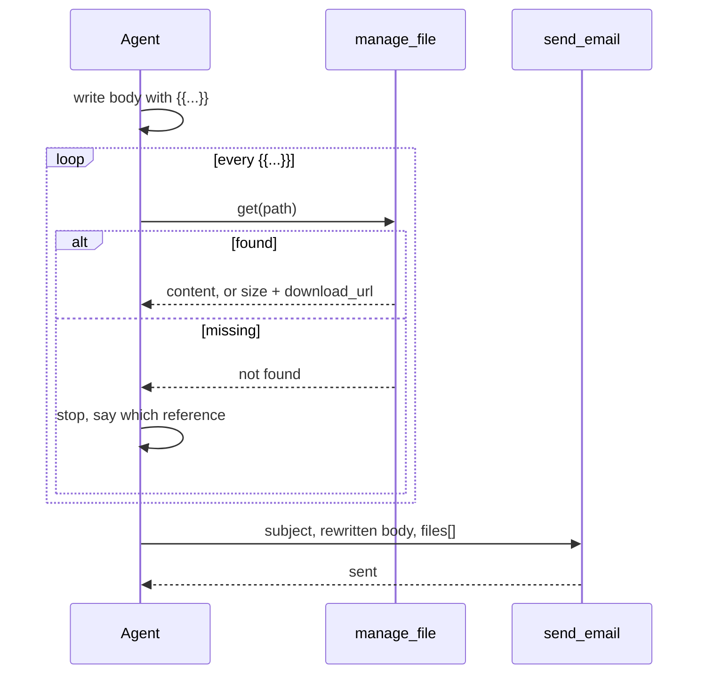

# Option 2 — the client expands the body before it sends

The `{{...}}` grammar is a thing the skill tells the agent to write, and the same skill tells
it to resolve every reference itself before the call. The servers never see a `{{`.

## Classes

| Class | What changes |
|---|---|
| `plugins/claude/skills/lamoom/SKILL.md` | the delivery line grows the grammar and the expansion it must do first |
| `plugins/codex/skills/lamoom/SKILL.md` | the same edit, byte for byte |
| `manage_file action=get` | read only, called once per reference to prove the path and to get a `download_url` for an inline one |
| `send_email(..., files?)` | unchanged. The expanded `files[]` is what the agent passes |
| `run.email(run_id, subject, body)` | unchanged, and this is the problem — see below |

## The seam

Inside the agent, between writing the body and making the call. There is no seam in any
running system: nothing is deployed, and the whole change is words in a skill file.

## Keys

None. Nothing stored, nothing read that was not already readable.

## The three forms

| Written | What the agent does before the call |
|---|---|
| `{{inline:path}}` | `manage_file get` the path, take `download_url`, replace the token with `` |
| `{{path}}` | replace the token with the file name, append the path to `files[]` |
| `{{link:path}}` | replace the token with `[name](https://studio.lamoom.com/path)` |

## Sequence

## The honest case FOR

It ships today, from the one repository this session can reach, with no deploy and no server
change: the whole of it is an edit to two identical skill files. It costs nothing to try and
nothing to undo. It is also the only option that satisfies A5 with no exception at all — the lambda stays dumb
storage and the agent does the thinking — which is the strongest thing that can be said for it,
and it is said here rather than left for a judge to find. Kate writes the same three forms either way, so
the grammar she asked for is real from the first day even if the resolver moves later.

## What it actually costs, said out loud

- `run.email` has no `files` argument, so through mcp.lamoom.com — the server she named — this
  option can attach nothing at all. `{{path}}` there degrades to a link, silently.
- Inline is a `download_url`, and a presigned URL expires. The mail is correct on Tuesday and
  a row of broken image boxes on Friday. That fails R2: she opens the mail to review the
  result, and the mail is the thing that decayed.
- N references is N extra round trips before every send.
- The expansion lives in a prompt, so it holds only as long as every client obeys it. The first
  session that forgets sends Kate a mail with `{{...}}` printed in it. A7 is a hope here, not
  a mechanism.
