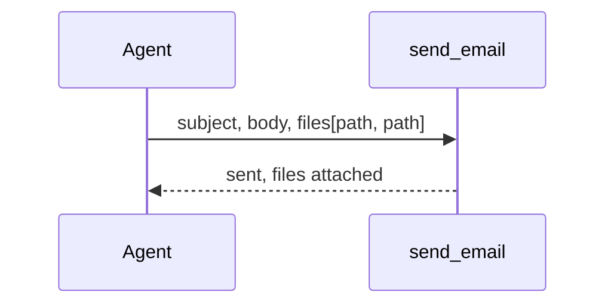

# Option 3 — do nothing new: `files[]` and a pasted link

The option that adds no grammar at all. It is what the product does today, written down
honestly so the other options are compared against a real thing and not against a strawman.

## Classes

Nothing changes anywhere.

| Class | What it already does |
|---|---|
| `send_email(subject, body, workflow_id?, files?)` | attaches up to 10 files, 7MB, paths resolved like a `manage_file` read |
| `SKILL.md` line 348 | `deliver  send_email the result, the FILE ATTACHED, never retyped into the body` |
| the studio | every path is already a URL: `https://studio.lamoom.com/` + path |

## The seam

None.

## Keys

None.

## Sequence

## The honest case FOR

Attaching already works and is already in the skill. A markdown link to
`https://studio.lamoom.com/{path}` already opens the file, so "review online results" (R2) is
reachable today by writing that link by hand. Nothing new can break, nothing new must be
deployed, and no grammar has to be learned by anyone.

## Why it is not enough

The mail cannot show a picture — there is no way to put an attachment into the body, so a chart
arrives as a file to download rather than a thing she sees when the mail opens. Attaching and
mentioning are two separate acts, so the body says "the chart is attached" and the attachment
list says `chart.png` and nothing joins them: reorder them and nobody notices. Through
`run.email` there is no `files` argument, so on mcp.lamoom.com this option delivers text only.
And writing the studio URL by hand is a second path grammar in the body, which is exactly the
thing A8 exists to stop.
