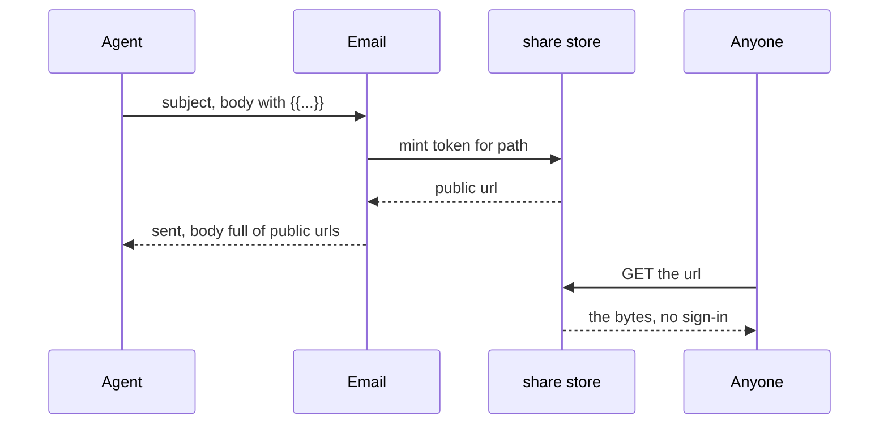

# Option 4 — mint a public URL per file and point the mail at it

The option I expect to reject, written properly so the rejection is earned.

Every `{{...}}` becomes a URL that anyone can fetch without signing in, so the mail carries no
bytes at all: `{{inline:path}}` is ``, `{{path}}` and `{{link:path}}` are both
links. Mail clients render remote images, so inline appears to work with no MIME work anywhere.

## Classes

| Class | What changes |
|---|---|
| a new share row | one per shared path, holding the token and what it points at |
| a public read endpoint | takes the token, streams the bytes, no session |
| `run.email` / `send_email` | replace each `{{...}}` with that URL |

## The seam

Between the mail and the file store there is now a third thing: a public reader with its own
address space and its own lifetime.

## Keys

`pk = USER#{user_id}`, `sk = SHARE#{token}` — a row whose only reader is a fetch that has no
user attached to it. That is already the sentence that kills it.

## Sequence

## The honest case FOR

Inline images render in every mail client with no `cid` handling and no attachment size limit,
so a 30MB video still shows a poster frame and a 7MB cap stops mattering (A4 stops binding).
One mechanism serves all three forms. And the link survives forwarding — Kate can send the mail
to somebody who has no Lamoom account and they can still open the result.

## Why it is rejected

It repeals A6: a new row kind whose only reader is an unauthenticated fetch, which is the exact
thing key_role says never to add. It turns every emailed result into a URL that leaks the moment
the mail does, and Lamoom's runs hold a solo founder's unshipped work. A9 asks who reads the
row and what it changes for them, and the honest answer is "anyone with the link, and it changes
who can read Kate's files" — which is a product decision about sharing, not a decision about
how a mail carries a file. If sharing is wanted, it is its own feature with its own run, and it
should not arrive as a side effect of putting a chart in an email.
